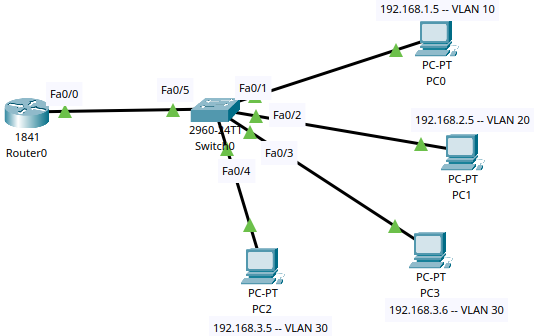

**Une seule interface… pour trois VLANs !?**
Eh oui, c’est possible grâce à la magie du **Router-on-a-Stick** 
Aujourd’hui, j’ai mis en place un TP Cisco où **une seule interface physique sur le routeur** devient **trois passerelles logiques** pour permettre la communication inter-VLAN.
Résultat ? VLAN10, VLAN20, et VLAN30 se parlent comme s’ils étaient sur le même réseau 

Envie de tester ? Le fichier Packet Tracer (.pkt) du TP est dispo ici 👉 https://github.com/Bamolitho/router-on-a-stick_sub-interfaces 

\#Cisco #PacketTracer #Networking #RouterOnAStick #VLAN #Cybersecurity #FormationIngenieur #CCNA


# TP Réseaux Cisco – Router-on-a-Stick avec Sub-Interfaces

## Objectif

Mettre en place un réseau multi-VLANs avec communication inter-VLAN grâce à la technique **Router on a stick** via des sub-interfaces sur un routeur Cisco.

---

## Contexte

Tu disposes de l’infrastructure suivante :

- **Switch (Cisco 2960-24TT)**
- **Routeur (ex: Cisco 1841)**
- **4 PCs** connectés chacun à une interface du switch :

| PC   | Interface Switch | VLAN | Adresse IP     | Gateway     |
| ---- | ---------------- | ---- | -------------- | ----------- |
| PC0  | Fa0/1            | 10   | 192.168.1.5/24 | 192.168.1.1 |
| PC1  | Fa0/2            | 20   | 192.168.2.5/24 | 192.168.2.1 |
| PC2  | Fa0/4            | 30   | 192.168.3.5/24 | 192.168.3.1 |
| PC3  | Fa0/3            | 30   | 192.168.3.6/24 | 192.168.3.1 |

- Le **routeur** est connecté au **switch via Fa0/5 ⇄ Fa0/0**
- Le lien **Fa0/5** est en mode **trunk** (transporte les VLANs)

## Topologie



---


## Qu’est-ce que Router on a Stick ?

**Router on a stick** est une méthode de communication inter-VLAN dans laquelle un **seul port physique** du routeur est utilisé pour gérer **plusieurs VLANs** grâce à des **sub-interfaces**.

Chaque **sub-interface** correspond à un VLAN, et sert de **passerelle** pour ce VLAN.

Le port du switch (Fa0/5) connecté au routeur doit être configuré en **mode trunk**.

---


## CONFIGURATIONS

### 1. Configuration des PC

```plaintext
Comme dans le tableau ci-dessus
```


## 2. Configuration du Switch

```bash
Switch> enable
Switch# configure terminal

! Création des VLANs
Switch(config)# vlan 10
Switch(config-vlan)# name VLAN10
Switch(config-vlan)# exit

Switch(config)# vlan 20
Switch(config-vlan)# name VLAN20
Switch(config-vlan)# exit

Switch(config)# vlan 30
Switch(config-vlan)# name VLAN30
Switch(config-vlan)# exit

! Attribution des VLANs aux interfaces
Switch(config)# interface fa0/1
Switch(config-if)# switchport mode access
Switch(config-if)# switchport access vlan 10
Switch(config-if)# exit

Switch(config)# interface fa0/2
Switch(config-if)# switchport mode access
Switch(config-if)# switchport access vlan 20
Switch(config-if)# exit

Switch(config)# interface fa0/3
Switch(config-if)# switchport mode access
Switch(config-if)# switchport access vlan 30
Switch(config-if)# exit

Switch(config)# interface fa0/4
Switch(config-if)# switchport mode access
Switch(config-if)# switchport access vlan 30
Switch(config-if)# exit

! Configuration du port trunk vers le routeur
Switch(config)# interface fa0/5
Switch(config-if)# switchport mode trunk
Switch(config-if)# exit

Switch(config)# exit
Switch# copy running-config startup-config 
Switch#
```

------

## 3. Configuration du Routeur

```bash
Router> enable
Router# configure terminal

! Sub-interface pour VLAN 10
Router(config)# interface fa0/0.10
Router(config-subif)# encapsulation dot1Q 10
Router(config-subif)# ip address 192.168.1.1 255.255.255.0
Router(config-subif)# exit

! Sub-interface pour VLAN 20
Router(config)# interface fa0/0.20
Router(config-subif)# encapsulation dot1Q 20
Router(config-subif)# ip address 192.168.2.1 255.255.255.0
Router(config-subif)# exit

! Sub-interface pour VLAN 30
Router(config)# interface fa0/0.30
Router(config-subif)# encapsulation dot1Q 30
Router(config-subif)# ip address 192.168.3.1 255.255.255.0
Router(config-subif)# exit

! Activation de l’interface physique
Router(config)# interface fa0/0
Router(config-if)# no shutdown
Router(config-if)# exit

Router(config)# exit
Router# copy running-config startup-config 
Router#
```


### Pourquoi cette commande est importante :

```bash
Router(config-subif)# encapsulation dot1Q 10 (<VLAN_ID>, en général)
```

### **Rôle** :

Elle indique que **cette sous-interface** du routeur gère le **trafic du VLAN 10** en utilisant le protocole **802.1Q (dot1Q)**, qui permet le **tag VLAN** sur un lien trunk.

Sans cette commande ?

Le routeur ne saura pas à quel VLAN le trafic appartient → **pas de communication entre les VLANs**, le **router-on-a-stick ne fonctionne pas** !

------

### Donc :

>  `encapsulation dot1Q <VLAN_ID>` = "Hé routeur, ce trafic appartient au VLAN `<VLAN_ID>`"
>  C’est **essentiel** pour que le routeur puisse **comprendre, trier et router** les paquets VLAN par VLAN sur **une seule interface physique**.


